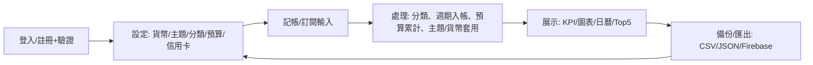

## App 核心與價值
- 記帳/訂閱/預算/報表/信用卡一站式；多貨幣、多主題；CSV/JSON + Firebase 雲端備份。
- 自動化：訂閱到期自動入帳，預算進度/超標提示，信用卡年費/回贈管理。

## App 解決的問題
- 分散的收支、訂閱扣款、預算管控與報表難以統整。
- 手動記錄繁瑣，換機或遺失風險。
- 缺少可視化與提醒，難以保持財務自律。

## 主要使用流程（簡潔步驟）
- 註冊（Email 驗證）/登入 → 選擇貨幣與主題。
- 記帳：輸入金額/分類/標籤/收據 → 儲存；訂閱：設定週期/扣款日 → 自動入帳。
- 檢視：月曆看每日收支；統計看 KPI、趨勢、分類、Top5。
- 管理：分類/預算/信用卡 → 設定提醒與主題。
- 備份：CSV/JSON 匯出/匯入；Firebase 雲端備份/還原。

## 使用者優點/賣點
- 一站式：記帳、訂閱、預算、報表、信用卡全包。
- 自動化：訂閱到期自動入帳、預算超標提醒、信用卡年費/回贈管理。
- 清晰可視化：KPI 卡、趨勢/餅圖/Top5，月曆日格顯示每日收支。
- 安心備份：CSV/JSON 全量備份 + Firebase 雲端，換機不怕遺失。
- 客製化：多貨幣、多主題、分類/標籤自由組合。

## 使用者旅程 / 邏輯
- Journey：註冊/驗證 → 設定貨幣/主題 → 記帳/訂閱 → 觀察統計 → 調整預算/分類 → 備份。
- 模組連結：Auth → Settings(貨幣/主題) → Transactions/Subscriptions → Calendar/Reports → Backups。
- 輸入→處理→輸出：輸入(交易/訂閱/預算) → 處理(分類、週期入帳、預算累計、匯率符號、主題套用) → 輸出(KPI/圖表/列表/提醒/匯出/備份)。

### Mermaid 流程示意

App Store 風格介紹
產品賣點：一站式記帳 + 訂閱自動入帳 + 預算提醒 + 信用卡管理 + 雲端備份。
為咩人而設：想掌握日常收支、管理訂閱扣款、控預算、保留備份的用戶。
主要功能：快速記帳、訂閱週期入帳、分類/預算、信用卡回贈/年費、KPI/趨勢/Top5 圖表、CSV/JSON/Firebase 備份。
使用場景：日常記帳、月底對賬、訂閱扣款提醒、預算超標警示、換機/多裝置同步。
Tagline：SmartFinance——少煩惱，多掌握，收支一目了然。

專案技術棧
React 19.2.1 + TypeScript

Firebase 10.12.0（Auth + Firestore + Storage）

React Router Dom 6.26.2

Recharts 2.12.7（圖表）

Tailwind CSS 3.4.3

Lucide React 圖示

## 開發 / 預覽
- 開發（建議，不會白畫面）：`npm run dev`
- 產出可用的靜態檔：`npm run build`
- 預覽 build 結果：`npm run preview`
- VSCode「Go Live / Live Server」：
  - 先 `npm run build`
  - 本專案已內建 `.vscode/settings.json`，Go Live 會直接以 `dist/` 為網站根目錄（避免打開原始 `index.html` 造成白畫面）
  - 若你之前已經註冊過舊版 Service Worker，請先在瀏覽器 DevTools → Application → Service Workers `Unregister` / `Clear site data`
